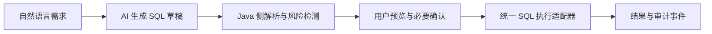

<div align="center">
  

  # SQLTeacher

  **安全、可验证、本地优先的 SQL 教学桌面应用**

  从 SQL 练习、AI 草稿与风险检测，到课程知识、学习诊断和云端教学协作。

  [](https://github.com/danlingdan/Teacher/releases/latest)
  [](https://github.com/danlingdan/Teacher/actions/workflows/release.yml)
  [](https://openjdk.org/projects/jdk/21/)
  [](https://github.com/danlingdan/Teacher/releases/latest)
  [](LICENSE)

  [下载最新版](https://github.com/danlingdan/Teacher/releases/latest) · [文档中心](docs/README.md) · [使用指南](docs/guide/README.md) · [更新日志](docs/releases/v1.11.5.md) · [问题反馈](https://github.com/danlingdan/Teacher/issues)
</div>

---

## 为什么选择 SQLTeacher

SQLTeacher 面向数据库课程教学与自主练习。它把 SQL 执行、确定性判题、风险拦截、AI 辅助、课程知识和学习反馈放在同一个桌面工作区中；网络或 AI 服务不可用时，核心本地练习能力仍可继续使用。

| 能力 | 说明 |
| --- | --- |
| 🧪 安全 SQL 实验 | SQLite 演示库、结构浏览、结果限制、多语句拦截和高风险操作确认 |
| 🤖 受控 AI 助手 | 支持本地 Ollama 和用户配置的网络 AI；模型只生成草稿，不能直接执行 SQL |
| 🎯 可验证学习闭环 | 练习、任务、反馈、知识点诊断和学习计划均保留可解释的确定性依据 |
| 📚 课程知识中心 | 文档导入、全文与混合检索、来源引用、版本修订和发布边界 |
| 👩‍🏫 教学协作 | 班级、任务、提交、教师反馈、学情看板、干预队列和脱敏 CSV 导出 |
| 🛡️ 通用软件能力 | 可信更新、问题反馈、诊断包、备份恢复、代理、无障碍和隐私说明 |
| 🌐 多语言与账号治理 | 完整英文界面、命令面板、可信密码重置、活跃会话、数据导出与账号注销 |

## v1.11 亮点

- **更顺滑的更新**：断点续传（HTTP Range）、受控镜像回退、分阶段发布与紧急暂停工具。
- **更完整的反馈**：截图附件（提交前清理 EXIF/GPS）、反馈撤回与本人反馈数据导出。
- **完整的账号生命周期**：邮箱绑定与可信密码重置（一次性限时 Token、防枚举、重置撤销全部会话）、活跃会话查看与按设备撤销、云端数据导出与带冷静期的账号注销。
- **更好的桌面体验**：`Ctrl+K` 命令面板、完整英文界面（键完整性测试门禁）、可选的 Windows 原生通知（白名单正文）、按流量计费/低电量任务暂停、安装文件完整性检测与修复引导。
- **Cloud API 1.11**：新能力位与端点（反馈撤回/导出、截图附件、会话、账号导出/注销、密码重置、分阶段发布），最低兼容客户端保持 1.9.0。

完整变更见 [v1.11.5 发布说明](docs/releases/v1.11.5.md)、[v1.11 实施记录](docs/history/stages/stage8/2026-08-02-v111-closeout-implementation.md)和 [v1.11 实施计划](docs/plans/2026-08-02-v1.11-general-capabilities-closeout-plan.md)。

## 安全设计



- AI 永远不能直接执行 SQL，也不能直接访问 JDBC `Connection`。
- AI 输出一律视为不可信输入，必须经过 Java 侧解析与风险分析。
- 多语句默认禁止；`DROP DATABASE`、`GRANT`、`REVOKE` 等语句默认拦截。
- 更新只信任内置公钥和固定 HTTPS 来源；下载完成后再次校验大小与 SHA-256。
- 诊断默认不包含数据库、SQL、Prompt、密码、Token、AI Key 或用户附件。
- 云端与 AI 均为增强能力，失败时不阻断本地 SQL 学习流程。

## 下载与运行

### Windows 用户

前往 [GitHub Releases](https://github.com/danlingdan/Teacher/releases/latest) 下载：

- `SQLTeacher-1.11.5.exe`：推荐，标准 Windows 安装器；
- `SQLTeacher-1.11.5-windows-x64.zip`：免安装便携版；
- `SHA256SUMS.txt`：发布文件完整性校验值。

正式包自带 Java 运行时，无需另装 JDK。用户数据默认保存在 `%LOCALAPPDATA%\SQLTeacher`，升级应用不会覆盖该目录。

### 从源码运行

环境要求：JDK 21、Maven 3.9+，可选安装 [Ollama](https://ollama.com/) 以启用本地 AI。

```powershell
git clone https://github.com/danlingdan/Teacher.git
cd Teacher
mvn test
mvn javafx:run
```

无图形环境可运行命令行验证：

```powershell
mvn -q compile exec:java "-Dexec.mainClass=com.sqlteacher.StageOneVerificationApp"
```

构建 Windows 安装包：

```powershell
.\packaging\package-stage1.ps1
```

## 技术栈

```text
Java 21 + JavaFX + Spring Context
SQLite / MySQL / MariaDB
Jackson + SLF4J + Logback
Lucene + SQLite FTS5
Ollama / OpenAI-compatible providers
Maven + jpackage + WiX Toolset
```

项目保持清晰的依赖方向：

```text
desktop -> application -> domain
infrastructure -> application / domain
```

主要目录：

```text
src/main/java/com/sqlteacher/application     应用服务与稳定契约
src/main/java/com/sqlteacher/domain          领域模型、异常与规则
src/main/java/com/sqlteacher/infrastructure  数据库、AI、云端与持久化适配器
src/main/java/com/sqlteacher/desktop         JavaFX 界面与控制器
src/main/resources                           FXML、CSS、配置与法律声明
src/test                                     单元、集成与回归测试
packaging                                    Windows 打包脚本
docs                                         指南、计划、验收与发布说明
```

## 开源软件与许可证

SQLTeacher 项目自身采用 **[Apache License 2.0](LICENSE)**。这只适用于 SQLTeacher 自有代码与文档；第三方软件仍分别受其原始许可证约束。

### 随应用使用的主要开源组件

| 软件 | 当前版本 | 用途 | 许可证 |
| --- | ---: | --- | --- |
| [OpenJFX / JavaFX](https://github.com/openjdk/jfx) | 21.0.11 | 桌面界面 | GPL-2.0 with Classpath Exception |
| [AtlantaFX](https://github.com/mkpaz/atlantafx) | 2.1.0 | JavaFX 主题与样式 | MIT |
| [Xerial SQLite JDBC](https://github.com/xerial/sqlite-jdbc) | 3.50.3.0 | 本地 SQLite 访问 | Apache-2.0；其随附原生代码另含 BSD-2-Clause / SQLite 相关许可 |
| [MySQL Connector/J](https://github.com/mysql/mysql-connector-j) | 9.4.0 | MySQL 连接 | GPL-2.0 with Universal FOSS Exception 1.0 |
| [MariaDB Connector/J](https://github.com/mariadb-corporation/mariadb-connector-j) | 3.5.9 | MariaDB 连接 | LGPL-2.1-or-later |
| [Jackson](https://github.com/FasterXML/jackson) | 2.22.1 | JSON 解析 | Apache-2.0 |
| [Spring Framework](https://github.com/spring-projects/spring-framework) | 6.2.19 | 依赖注入与应用装配 | Apache-2.0 |
| [SLF4J](https://github.com/qos-ch/slf4j) | 2.0.16 | 日志门面 | MIT |
| [Logback](https://github.com/qos-ch/logback) | 1.5.38 | 日志实现 | EPL-2.0 OR LGPL-2.1-only |
| [Apache Lucene](https://lucene.apache.org/) | 10.4.0 | 本地全文与向量检索 | Apache-2.0 |
| [jsoup](https://jsoup.org/) | 1.22.2 | 安全网页内容解析 | MIT |
| [Apache PDFBox](https://pdfbox.apache.org/) | 3.0.7 | PDF 文本导入 | Apache-2.0 |

构建与测试还使用 [Apache Maven](https://maven.apache.org/)（Apache-2.0）、[JUnit 5](https://junit.org/junit5/)（EPL-2.0）、[CycloneDX Maven Plugin](https://github.com/CycloneDX/cyclonedx-maven-plugin)（Apache-2.0）和 [WiX Toolset](https://wixtoolset.org/)（Microsoft Reciprocal License）。可选的外部服务或独立程序（例如 [Ollama](https://github.com/ollama/ollama)、数据库服务器、网络 AI 模型）不会作为 SQLTeacher 源码的一部分重新授权，其软件、模型和内容条款由各自提供方决定。

发行包中的完整组件版本与许可证以以下材料为准：

- [第三方许可证清单](src/main/resources/legal/THIRD-PARTY-LICENSES.txt)
- 发布包随附的 `sqlteacher-sbom.json`（CycloneDX SBOM）
- 各上游项目的许可证原文与随附通知

如发现遗漏或许可证标注有误，请通过 [GitHub Issues](https://github.com/danlingdan/Teacher/issues) 报告。项目名称、商标和第三方内容仍归各自权利人所有。

## 贡献

欢迎提交 Issue 和改进建议。贡献代码前请先阅读 [AGENTS.md](AGENTS.md) 中的架构、安全、测试与隐私约束。提交到本项目的贡献默认按 Apache License 2.0 第 5 条授权，除非贡献者另有明确声明。

## License

Copyright remains with the respective SQLTeacher contributors.

Licensed under the [Apache License, Version 2.0](LICENSE). The software is provided on an **“AS IS”** basis, without warranties or conditions of any kind.
