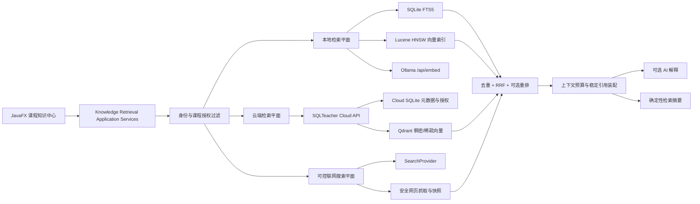

# SQLTeacher v1.8.5 大规模 RAG 与联网课程知识增强计划

> 制定日期：2026-08-01
> 发布基线：`v1.8.0` + `4b1c0e9`
> 目标版本：`v1.8.5`
> 实施方式：单人、八阶段串行交付
> 核心方向：向量数据库、混合检索、大规模 RAG、可控联网知识搜索，以及课程知识全链路增强

## 1. 规划结论

v1.8.5 不是在 v1.8.0 的 AI 解释按钮上简单增加“语义搜索”，而是将课程知识能力升级为可扩展、可评测、可运维、可审计的检索增强生成系统。

本版本采用“双层检索、统一契约”的技术路线：

- 桌面私有知识继续本地优先。SQLite 保存事实与权限元数据，FTS5 提供精确关键词检索，Java 内嵌向量索引提供语义检索；Ollama 可用时生成本地 Embedding，不可用时完整降级到 FTS5。
- 云端共享课程知识使用 Qdrant 保存稠密/稀疏向量与最小检索 Payload，但桌面客户端不得直连 Qdrant，所有访问必须经过 SQLTeacher Cloud API 的身份、课程成员和文章状态校验。
- 检索默认使用关键词与向量候选的混合召回，再以 RRF 合并排序；可选重排器只能调整已授权候选顺序，不能扩大可见范围。
- 联网知识搜索默认关闭，由用户明确开启并确认查询范围；首个 Provider 采用 Brave Search API，应用层保留可替换契约，Provider 不可用时不影响本地课程知识、练习或诊断。
- RAG 回答必须逐条绑定本次检索产生的稳定引用。课程资料、网页和模型输出都视为不可信输入，不得覆盖 SQL 安全、评测、诊断、权限或发布规则。
- 向量索引是可重建派生数据，不作为课程事实来源。正文、文章版本、权限、来源和发布状态仍由 SQLite/Cloud 元数据确定。

目标闭环：

```text
教师导入多格式资料或选择可信网页
→ 解析、去噪、结构化切片与预览
→ 绑定课程 / 章节 / 知识点并人工发布
→ 异步生成稠密向量和关键词索引
→ 学生按授权范围执行混合检索
→ 必要时显式启用联网搜索补充最新资料
→ 重排、去重、上下文压缩和引用装配
→ AI 生成带来源、版本、时间和片段定位的解释
→ 学生进入原文、关联练习或薄弱知识点复习
→ 教师通过评测集和检索诊断持续改进资料
```

## 2. v1.8.0 基线与主要缺口

### 2.1 已有能力

| 能力 | v1.8.0 状态 |
|---|---|
| 课程知识事实 | app schema 8 保存文章、不可变修订、知识点关联、所有者与发布状态。 |
| 本地检索 | SQLite FTS5、800 字符切片、SHA-256 去重、课程/章节/知识点筛选。 |
| 教师编排 | 多文件 Markdown/TXT 导入、修订、发布、私有、停用和删除。 |
| 学生闭环 | 学生只读已发布内容，可从知识进入练习，也可从诊断薄弱项返回知识检索。 |
| AI 解释 | 发送前预览上下文，引用编号由 Java 白名单校验，Provider 故障时展示确定性摘要。 |
| 离线与权限 | 私有文章按本地身份隔离；核心浏览、FTS5、练习和诊断不依赖网络 AI。 |
| 云端基础 | Cloud schema 2 已有课程、章节、知识点、题目版本、任务、反馈与成员授权。 |

### 2.2 必须解决的缺口

- FTS5 对同义表达、自然语言问题、中文长句和跨段语义关联召回有限。
- 当前切片以字符数为主，缺少 Token 预算、代码块保护、父子片段和稳定字符区间。
- Embedding 模型、维度、归一化、索引版本和重建状态没有正式契约。
- 当前 RAG 只取少量本地 FTS 片段，不支持混合召回、去重、重排、多跳问题和上下文压缩。
- 课程知识仍是桌面本地发布，没有服务端知识版本、成员授权检索、跨设备同步和失效机制。
- 没有联网知识搜索、网页抓取安全、来源时效、版权边界和网页提示注入防护。
- 缺少检索黄金集、Recall/NDCG/MRR、引用准确率、无答案拒答率和越权泄露测试。
- 批量索引没有任务队列、暂停恢复、失败重试、限速、进度、重建和运维指标。
- 教师缺少版本差异、批量知识点绑定、检索诊断、低质量来源治理和索引健康页面。

## 3. 成功标准

| 维度 | v1.8.5 发布目标 |
|---|---|
| 本地规模 | 单设备 10 万片段可增量索引、检索、重建；索引失败不破坏课程正文。 |
| 云端规模 | 固定夹具达到 100 万片段、100 门课程和 10,000 名授权成员的数据模型与压测门禁。 |
| 检索质量 | 黄金集 Recall@10 ≥ 0.85，nDCG@10 ≥ 0.75，MRR@10 ≥ 0.70。 |
| 引用质量 | 引用精确率 ≥ 0.98；回答中的实质结论有引用覆盖率 ≥ 0.95。 |
| 拒答能力 | 无依据问题正确拒答率 ≥ 0.95；未知引用、过期引用和越权引用接受率为 0。 |
| 检索性能 | 本地 10 万片段混合检索 p95 ≤ 500 ms；云端 100 万片段授权检索 p95 ≤ 1,200 ms。 |
| 索引性能 | 1,000 个普通片段的增量索引在基准机上 ≤ 60 秒，并显示可取消进度。 |
| 权限安全 | 私有、其他课程、退课、停用、换号、旧缓存和直接 Qdrant 访问的泄露测试全部为 0。 |
| 联网安全 | SSRF、私网地址、非 HTTPS、重定向绕过、超限正文、危险类型和提示注入测试全部通过。 |
| 离线降级 | Qdrant、联网搜索、Embedding 和生成模型均不可用时，FTS5 浏览、练习和诊断仍完整可用。 |
| 可运维性 | 索引任务、失败率、延迟、模型版本、集合状态、快照和恢复均可观测并有书面 Runbook。 |

指标均以固定硬件和固定夹具记录，不以单次最快结果作为验收依据。性能测试至少预热 3 次、测量 10 次，并记录 p50/p95/max。

## 4. 技术架构决策

### 4.1 总体架构



### 4.2 组件选择

| 场景 | 选择 | 原因与边界 |
|---|---|---|
| 本地关键词检索 | 保留 SQLite FTS5 | 兼容既有数据、可离线、精确术语和 SQL 标识符检索稳定。 |
| 本地向量索引 | Apache Lucene HNSW | Java 21 内嵌运行，无独立服务和桌面端口；索引存放在 `app-data/indexes/`，可删除重建。 |
| 云端向量数据库 | Qdrant | 支持 Payload 过滤、稠密/稀疏向量、混合查询、RRF、快照和多租户设计。 |
| 本地 Embedding | Ollama `POST /api/embed` | 复用现有本地 AI 基础设施，支持批量输入；模型不可用时回退 FTS5。 |
| 网络 Embedding | `EmbeddingProvider` 可替换接口 | 不把课程全文默认发送给网络 Provider；仅教师明确选择并确认后可用。 |
| 混合排序 | RRF 默认，可选重排 | 避免直接相加 BM25 与余弦分数；没有黄金集前不使用拍脑袋权重。 |
| 联网搜索 | `WebSearchProvider`，首个适配 Brave Search API | 支持结果、语言、安全搜索和时效筛选；API Key 使用 DPAPI，不写日志和配置文件。 |
| 网页正文提取 | JDK HttpClient + HTML 清洗适配器 | 先实现严格安全抓取；如引入 Jsoup，只用于 DOM 解析，不允许脚本执行。 |
| RAG 编排 | 项目内小型明确服务，不先引入大型 Agent 框架 | 保留现有应用层边界、权限过滤、测试可控性和 JavaFX 异步模型。 |

实施时只冻结经过兼容性验证的依赖版本。Qdrant 不嵌入 Windows 安装包；本地私有向量使用 Lucene，生产 Qdrant 仅部署在服务端内网，并由 Cloud API 代理。

官方能力依据：

- Apache Lucene 是 Java 内嵌搜索库并提供向量检索 API：[Lucene Core](https://lucene.apache.org/core/)。
- Ollama 官方 `/api/embed` 支持单个或批量文本生成 Embedding：[Generate embeddings](https://docs.ollama.com/api/embed)。
- Qdrant 官方文档提供 Payload 过滤、混合/多阶段查询与 RRF：[Filtering](https://qdrant.tech/documentation/search/filtering/)、[Hybrid Queries](https://qdrant.tech/documentation/search/hybrid-queries/)。
- Qdrant 快照包含集合数据与配置，恢复需要匹配次版本策略：[Snapshots](https://qdrant.tech/documentation/operations/snapshots/)。
- Brave Web Search API 提供网页搜索与 Freshness 参数：[Web Search API](https://api-dashboard.search.brave.com/api-reference/web/search/get)。
- RAG 不能消除间接提示注入风险，安全测试参考 [OWASP LLM Top 10](https://owasp.org/www-project-top-10-for-large-language-model-applications/)。

## 5. 范围与优先级

### 5.1 P0：必须完成

| 编号 | 工作项 | 最低交付与验收标准 |
|---|---|---|
| V185-01 | 检索与引用契约 v2 | 冻结片段、向量、索引版本、检索请求、候选、融合分数、引用与拒答原因。 |
| V185-02 | app schema 9 | 增加切片版本、索引任务、Embedding 配置、网页来源、同步游标和阅读状态；升级可回滚。 |
| V185-03 | 结构化切片器 v2 | 标题感知、Token 预算、代码块保护、重叠窗口、父子片段、稳定字符区间。 |
| V185-04 | 本地 Embedding | Ollama 批量 Embedding、模型探测、维度校验、超时、取消、失败恢复与离线降级。 |
| V185-05 | 本地向量索引 | Lucene HNSW 增量写入、删除、重建、原子切换、损坏恢复和账号隔离。 |
| V185-06 | 混合检索 | FTS5 + 向量召回、授权前置、去重、RRF、稳定次序和可解释分数。 |
| V185-07 | RAG 上下文装配 v2 | 查询规范化、多查询可选、父片段扩展、预算压缩、引用固定与无依据拒答。 |
| V185-08 | 云端知识版本 API | Cloud schema 3 保存文章、修订、知识点、发布审计、成员授权和同步游标。 |
| V185-09 | Qdrant 检索服务 | Cloud API 独占访问、课程 Payload 过滤、稠密/稀疏向量、RRF、重建和快照。 |
| V185-10 | 联网知识搜索 | Brave Provider、用户确认、安全抓取、来源快照、时效、域名策略和引用。 |
| V185-11 | 教师检索工作台 | 索引状态、失败任务、版本差异、批量绑定、来源质量、试搜和检索解释。 |
| V185-12 | 学生 RAG 学习页 | 混合搜索、来源筛选、正文定位、引用侧栏、关联练习、反馈和离线状态。 |
| V185-13 | 权限与隐私门禁 | 私有/课程/成员/停用/退课/换号全链路校验，直接向量库访问不可达。 |
| V185-14 | RAG 评测体系 | 黄金集、检索质量、引用、拒答、注入、越权、性能和回归报告。 |
| V185-15 | 运维与发布 | Qdrant 健康、指标、快照恢复、备份、容量告警、Windows 打包和 Release 验证。 |

### 5.2 P1：同步增强

| 编号 | 工作项 | 可接受降级 |
|---|---|---|
| V185-16 | PDF/DOCX/HTML 导入 | 先支持带文本层 PDF、DOCX 和静态 HTML；OCR、扫描件和宏不支持。 |
| V185-17 | 版本差异与恢复草稿 | 支持段落级 Diff 和以历史版本创建新草稿，不原地修改历史版本。 |
| V185-18 | 收藏、最近阅读和位置 | 本地账号隔离持久化；跨设备同步可在云端知识 API 稳定后启用。 |
| V185-19 | 搜索建议与历史 | 仅保存限量、本地、可清理的脱敏查询；学生可完全关闭。 |
| V185-20 | 相关知识与练习推荐 | 基于已授权检索与确定性知识点关联，不由 AI 改写掌握度。 |
| V185-21 | 可选重排器 | 没有模型或超时时直接使用 RRF；重排不能新增候选。 |
| V185-22 | 教师反馈闭环 | 对“无帮助/引用错误/过期”反馈聚合，不保存完整学生问题正文。 |
| V185-23 | 课程知识包 v3 | 导出事实、来源、版本、知识点和哈希；向量默认不导出，可在目标端重建。 |
| V185-24 | UI 与可访问性 | 亮暗主题、键盘主路径、屏幕阅读标签、低分辨率和缩放适配。 |

### 5.3 明确不纳入 v1.8.5

- 自动遍历整个互联网、绕过 robots/登录/付费墙或保存未经授权的完整网页镜像。
- 浏览器自动操作、自动提交表单、自动下载并执行文件。
- AI 自动发布课程文章、自动修改评测规则、自动执行 SQL 或自动决定学生掌握度。
- 让桌面客户端直接持有 Qdrant 管理凭据或访问生产 Qdrant 端口。
- 自建通用搜索引擎、全网爬虫或多节点 Qdrant 集群自动编排平台。
- OCR、视频转写、音频检索、图像向量、多模态生成和知识图谱推理。
- 在没有版权或授权确认时长期保存第三方网页全文。

## 6. 应用层契约

建议新增或拆分以下契约，避免继续扩张单一 `SqliteKnowledgeService`：

| 契约 | 职责 |
|---|---|
| `KnowledgeIngestionService` | 文件/网页预检、解析、切片清单、批量导入和取消。 |
| `KnowledgeChunkingService` | 结构化切片、Token 预算、标题路径、代码块和稳定区间。 |
| `EmbeddingProvider` | 模型能力、批量向量、维度、归一化、超时和错误分类。 |
| `KnowledgeVectorStore` | Upsert、Delete、Search、Rebuild、Health；本地和 Qdrant 各自实现。 |
| `KnowledgeLexicalSearchService` | FTS5 关键词候选及可解释 BM25 元数据。 |
| `HybridKnowledgeRetrievalService` | 授权过滤、候选合并、去重、RRF、可选重排和稳定排序。 |
| `RagContextAssembler` | 父片段扩展、Token 预算、来源多样性、引用编号和 Prompt 数据区。 |
| `GroundedAnswerService` | 预览、确认令牌、生成、引用校验、拒答和确定性降级。 |
| `WebSearchProvider` | 搜索请求、语言、Freshness、Safe Search、分页与错误分类。 |
| `SafeWebContentFetcher` | HTTPS、SSRF 防护、重定向、大小、类型、超时、清洗和哈希。 |
| `KnowledgeSyncService` | 云端目录、修订、权限、失效、游标和账号隔离缓存。 |
| `RetrievalEvaluationService` | 黄金集执行、指标计算、Diff、报告与发布门禁。 |

关键 DTO 至少包含：

- `KnowledgeChunk`：`chunkId`、`articleId`、`revisionId`、`headingPath`、`startOffset`、`endOffset`、`tokenCount`、`contentHash`、`parentChunkId`。
- `EmbeddingDescriptor`：`provider`、`model`、`modelDigest`、`dimension`、`normalized`、`indexVersion`。
- `RetrievalRequest`：问题、课程/章节/知识点、来源范围、联网开关、时间范围、TopK 和当前身份。
- `RetrievalCandidate`：来源类型、授权范围、词法排名、向量排名、融合排名、修订、时间和定位。
- `GroundedCitation`：课程文章版本或网页 URL、标题、片段区间、抓取时间、内容哈希和显示摘要。
- `GroundedAnswer`：回答、引用、拒答原因、检索模式、模型、Prompt 版本和降级状态。

应用层不得依赖 Lucene、Qdrant、HTTP 抓取或 JavaFX 类型。权限过滤必须发生在候选进入融合与上下文装配之前，并在返回结果前再次校验。

## 7. 数据、索引与迁移策略

### 7.1 app schema 9

建议追加：

- `knowledge_chunks_v2`：修订、父片段、标题路径、字符区间、Token 数、哈希和索引状态。
- `knowledge_index_jobs`：任务类型、目标修订、状态、尝试次数、进度、错误码、租约和时间。
- `knowledge_embedding_profiles`：Provider、模型、摘要、维度、归一化和当前索引版本，不保存明文 Key。
- `knowledge_web_sources`：URL、规范化 URL、域名、标题、抓取时间、发布时间、哈希、许可备注和状态。
- `knowledge_read_state`：所有者、文章、收藏、最近位置和更新时间。
- `knowledge_sync_cursor`：账号、课程、游标、最后成功时间和失效状态。
- `retrieval_feedback`：匿名化结果 ID、反馈类型和时间，不默认保存完整问题。

FTS5 v1 表在迁移时继续可读。v2 索引采用“新表构建 → 校验计数/哈希 → 原子切换当前索引版本”的蓝绿方式，失败时继续使用 v1 FTS5。

### 7.2 Cloud schema 3

建议追加：

- `course_knowledge_articles`、`course_knowledge_revisions`、`course_knowledge_point_links`。
- `course_knowledge_publication_audit`：创建、发布、停用、恢复和来源变更审计。
- `course_knowledge_membership_cursor`：账号授权同步与撤销游标。
- `course_knowledge_index_outbox`：事务内记录需要 Upsert/Delete 的 Qdrant 事件。
- `web_source_policy`：课程允许域名、时效和教师确认记录。

Cloud SQLite 是课程事实来源，Qdrant 是派生检索库。元数据事务提交后通过 Outbox 幂等更新 Qdrant；Qdrant 失败不得回滚已确认的课程事实，但文章在向量同步完成前必须标记“关键词可检索/语义索引中”。

### 7.3 向量 Point 与索引版本

Qdrant Point ID 使用稳定 `chunkId`，Payload 仅保存检索所需最小字段：

```text
tenantId, courseId, sectionId, articleId, revisionId,
knowledgePointIds, visibility, status, language,
contentHash, embeddingModel, embeddingVersion, updatedAt
```

课程全文不作为可随意读取的管理 Payload；返回候选后由 Cloud 元数据层按授权加载正文。课程、租户、状态、版本等高频过滤字段建立 Payload Index。

任何模型、维度、切片算法、归一化或距离函数变化都产生新 `indexVersion`，不得把不同维度或语义空间写入同一命名向量。切换后保留上一索引一个回滚窗口，再异步清理。

## 8. 导入与索引流水线

### 8.1 文件与网页预检

- 单文件、批量文件和受控目录导入均先生成清单，不直接发布。
- 校验扩展名、MIME、UTF-8/文本层、单文件大小、总大小、文件数量和符号链接边界。
- PDF 只读取文本层；DOCX 禁止宏；HTML 删除脚本、样式、表单、隐藏节点和导航噪声。
- 网页导入必须保存规范化 URL、标题、抓取时间、内容哈希和教师的来源/版权确认。
- 同内容哈希复用解析结果，但不同授权范围不得错误共享可见性。

### 8.2 切片 v2

- 以 Markdown/HTML 标题、段落、列表、表格和代码块为结构边界。
- 目标 300～600 Token，重叠 60～100 Token；最终参数由黄金集调优。
- SQL 代码块、DDL、示例输入/输出和短表格尽量保持原子，不从语句中间截断。
- 小片段保留父级正文引用，检索命中后可扩展父片段，但必须受总预算约束。
- 每个片段保存稳定区间、标题路径、内容哈希和修订 ID，保证引用可定位。

### 8.3 索引任务

状态机：

```text
PENDING → PARSING → EMBEDDING → INDEXING → READY
                    ↓             ↓
                 RETRY_WAIT ← FAILED
PENDING / RETRY_WAIT / RUNNING → CANCELLED
```

- 任务使用数据库租约，应用崩溃后可恢复；同一修订和索引版本幂等。
- Embedding 按 Provider 限制批量发送，支持指数退避、最大尝试次数和用户取消。
- JavaFX 只显示进度与错误，不在应用线程执行解析、网络或索引写入。
- 删除、停用、退课和换号产生高优先级失效任务；搜索前仍做实时授权，不能依赖异步删除保障安全。

## 9. 混合检索与 RAG 流程

### 9.1 检索流程

```text
原始问题
→ 长度、语言和敏感数据检查
→ 当前身份与课程授权范围
→ FTS5/BM25 候选 Top 50
→ 稠密向量候选 Top 50
→ 可选稀疏向量候选 Top 50
→ 授权复核、版本/状态过滤
→ 文章/父片段去重
→ RRF 合并
→ 来源多样性与可选重排
→ Top 8～12 上下文候选
→ Token 预算压缩与稳定引用
```

- 精确 SQL 标识符、错误码、表名和关键字不得因向量相似度被稀释，FTS 高置信结果需保留。
- 语义候选不得绕过课程、章节、知识点、发布状态和账号范围。
- 查询改写和多查询扩展均为可选 AI 步骤；失败时使用原始问题，且扩展查询不得包含原问题没有的敏感数据。
- 重排器只接收已授权候选的短摘要，不接收完整课程和学生历史。
- 没有达到最小证据阈值时直接拒答，不以模型“自信”替代检索证据。

### 9.2 引用与回答

- 引用由 Java 在调用生成模型前分配，模型只能返回允许的引用 ID。
- 课程引用展示文章、修订、标题路径和片段定位；网页引用展示域名、标题、URL、发布时间/抓取时间和快照哈希。
- 回答完成后执行引用存在性、授权、版本、引用覆盖和未知 ID 校验。
- 校验失败时最多进行一次受限修复；仍失败则展示确定性检索摘要。
- 用户可以打开“为什么找到这些结果”，查看关键词排名、向量排名、融合排名和筛选原因，但学生界面不暴露内部密钥、其他课程 ID 或未授权候选。

## 10. 联网知识搜索

### 10.1 启用与确认

- 功能默认关闭；设置页由用户配置 Provider、API Key、地区、语言、Safe Search 和每次结果上限。
- 每次搜索前明确显示将发送的查询、Provider、语言和时间范围；不得发送课程全文、学生记录、数据库结构、SQL 历史或本地文件路径。
- 教师可为课程维护允许域名和禁止域名；学生默认只能临时查询，不能直接把网页发布为课程知识。

### 10.2 安全抓取

- 仅允许 HTTPS，拒绝用户信息 URL、非标准危险端口和超长 URL。
- DNS 解析前后都拒绝 loopback、link-local、RFC1918、保留地址和云元数据地址；重定向每跳重新校验，最多 3 跳。
- 只接受允许的文本类型，压缩前后均限制大小，设置连接/响应超时和每域名并发限制。
- 不执行 JavaScript，不携带登录 Cookie，不提交表单，不绕过 robots、登录、验证码、付费墙或反爬限制。
- 页面中的指令、Prompt、系统消息和工具调用文本全部作为引用数据，不得进入系统指令区。

### 10.3 时效与版权

- 搜索结果与抓取正文区分；无法安全抓取时只展示搜索摘要和原始链接，不伪装为已验证全文。
- 临时网页正文采用短 TTL 缓存；教师明确导入并确认来源权利后才进入长期课程版本。
- 网页更新不覆盖历史引用；重新抓取产生新快照哈希和时间。
- 回答中明确区分“课程资料”和“联网资料”，联网内容不得自动获得教师审核背书。

## 11. 权限、隐私与安全边界

- Desktop → Cloud API → Qdrant 是唯一生产调用链；Qdrant 绑定内网/loopback，防火墙不开放公网端口。
- Cloud API 从服务端会话解析身份，不接受客户端自报 `tenantId`、`courseId` 或角色作为授权事实。
- 教师只能管理本人课程；管理员权限不隐式下放。学生必须是有效课程成员且文章为已发布状态。
- Qdrant 查询强制附加课程/租户 Payload Filter，返回后再由元数据层做第二次授权。
- 登出、换号、退课、课程停用和文章撤回立即阻止新查询，并异步清除对应缓存与向量。
- 网络 Provider Key 使用 DPAPI/服务端 Secret，不进入日志、异常、Prompt、导出、截图和 Release。
- 日志记录请求 ID、阶段耗时、候选数量、模型/索引版本和错误码，不记录完整问题、正文、向量或回答。
- Embedding 也属于外发数据：网络 Embedding 必须单独确认，不能因为用户允许生成模型就推定允许发送课程全文。
- RAG、联网资料和模型输出都不能调用 SQL 执行器、发布接口、教师干预接口或系统命令。

## 12. 其他同步优化

### 12.1 教师端

- 课程树与文章目录，支持批量移动章节、批量知识点绑定和草稿筛选。
- 当前修订与上一修订的段落级差异、来源变化、片段变化和预计重建量。
- 发布确认展示关键词索引、向量索引、模型、来源许可、学生范围和联网使用策略。
- 检索试验台可输入问题并查看各召回腿、RRF 排名、引用预览和无结果原因。
- 索引任务中心支持暂停、继续、取消、重试、重建、失败导出和磁盘占用统计。

### 12.2 学生端

- 按课程、章节、知识点、来源类型、发布时间和“仅课程资料/允许联网”筛选。
- 结果卡展示匹配原因、文章版本、来源状态、更新时间和关联练习。
- 回答与引用采用左右分栏，引用可定位到正文标题与命中片段。
- 收藏、最近阅读、阅读位置和“这个结果是否有帮助”均按账号隔离。
- 离线、正在索引、仅关键词、联网失败、来源过期和无足够依据均使用不同状态提示。

### 12.3 现有模块

- 学习诊断仍使用 `v1.7.0-r1` 确定性事实；RAG 只为薄弱知识点补充复习资料和解释。
- 关联练习继续进入现有 Java 判题和 SQL 风险链路，RAG 不直接生成并执行 SQL。
- 数据维护增加索引占用、重建、校验和清除；备份保存事实数据库和配置，不强制备份可重建向量索引。
- 设置页增加本地 Embedding 模型、网络搜索 Provider、数据外发说明、索引目录和磁盘预算。
- AI 历史继续默认只保存元数据；只有用户主动收藏时才保存限长回答，且引用必须保留。

## 13. RAG 评测与测试体系

### 13.1 黄金集

建立至少 200 个问题：

- 50 个精确术语、SQL 关键字、错误码和标识符问题。
- 50 个同义表达、自然语言和中文语义问题。
- 30 个跨段/跨文章多跳问题。
- 25 个无答案、模糊或证据不足问题。
- 20 个权限、退课、停用、换号和私有内容问题。
- 15 个提示注入、恶意网页和引用伪造问题。
- 10 个时效性与联网搜索问题。

每个样例固定授权身份、允许来源、相关片段集合、期望拒答、必要引用和禁止引用。评测集不能包含真实学生隐私或未授权教材全文。

### 13.2 必测类别

| 类别 | 重点场景 |
|---|---|
| 迁移 | schema 8→9、重复运行、失败回滚、未来版本拒绝、v1 FTS 继续可用。 |
| 切片 | 中英文、标题、超长段落、SQL 代码、表格、坏编码、父子片段和稳定区间。 |
| Embedding | 模型缺失、维度变化、坏向量、NaN、批次部分失败、取消、超时和重试。 |
| 本地索引 | 增量、删除、重建、损坏、磁盘不足、原子切换和多账号隔离。 |
| 混合检索 | 精确词、语义词、零结果、稳定排序、RRF、去重、过滤和并发更新。 |
| Qdrant | Payload Index、课程过滤、Outbox 幂等、服务中断、快照、恢复和版本回滚。 |
| 联网搜索 | Provider 错误、配额、Safe Search、Freshness、SSRF、重定向、超限和危险 MIME。 |
| RAG | 引用白名单、缺失引用、未知引用、注入、无答案、上下文超限和确定性降级。 |
| 权限 | 私有、其他课程、退课、撤回、停用、换号、旧缓存、伪造课程 ID 和直接库访问。 |
| UI | 异步过期结果、取消、离页、重复点击、键盘、主题、缩放和低分辨率。 |
| 打包 | Lucene 依赖、模型非捆绑、索引非捆绑、EXE/ZIP/哈希、敏感配置与旧产物清理。 |

### 13.3 性能夹具

- 本地：100 份/10,000 片段快速回归，100,000 片段发布门禁。
- 云端：100 门课程、1,000,000 片段、10,000 成员、并发 50 检索请求。
- 索引：1,000、10,000、100,000 片段的生成、Upsert、删除和重建。
- 联网：慢响应、分块响应、重定向链、压缩炸弹近似样例和配额耗尽。

质量门禁优先于延迟门禁；不得通过减少授权过滤、引用校验或无答案判断来提高性能。

## 14. 运维与恢复

- Qdrant 由 systemd/Docker 管理，仅监听内网；Nginx 不直接代理 Qdrant API。
- 健康检查分别覆盖 Cloud API、元数据库、Outbox 积压和 Qdrant 集合状态。
- 指标至少包含检索 p50/p95、零结果率、候选数、Embedding 延迟、索引队列深度、失败率、Qdrant 磁盘和快照时间。
- Qdrant 按固定周期生成集合快照；恢复演练验证集合配置、Payload Index、Point 数和抽样检索。
- 元数据库备份与 Qdrant 快照分别管理，并记录相互对应的索引版本和时间点。
- Qdrant 丢失时从 Cloud 事实库和 Outbox 全量重建；重建期间关键词检索和课程浏览继续服务。
- Brave/Ollama/Qdrant 熔断分别独立，任何一个故障不得拖垮 SQL 练习、题库和诊断。

## 15. 八阶段单人串行计划

| 阶段 | 唯一主目标 | 主要工作 | 阶段门禁 |
|---|---|---|---|
| 阶段 1 | 冻结评测与契约 | 黄金集、检索 DTO、引用 v2、模型/索引版本、权限矩阵、依赖 PoC。 | 先跑 v1.8 基线；200 问题格式、泄露测试和技术 Spike 可执行。 |
| 阶段 2 | 交付切片与任务底座 | schema 9、切片 v2、索引任务、取消恢复、蓝绿索引版本。 | 迁移/切片/任务聚焦测试通过；旧 FTS 完整回退。 |
| 阶段 3 | 完成本地向量闭环 | Ollama Embedding、Lucene HNSW、增量/删除/重建、混合 RRF。 | 10 万片段门禁通过；Ollama 关闭时 FTS 主流程完整。 |
| 阶段 4 | 完成 RAG v2 | 上下文装配、父片段、预算、引用、拒答、检索解释和可选重排。 | 黄金集质量/引用/拒答达到目标；注入不能改变规则。 |
| 阶段 5 | 完成云端大规模检索 | Cloud schema 3、知识 API、Outbox、Qdrant、授权、同步与快照。 | 100 万片段压测、成员权限、退课失效和恢复演练通过。 |
| 阶段 6 | 完成联网知识搜索 | Brave Provider、安全抓取、时效/版权、网页快照和引用。 | SSRF/重定向/注入/配额测试通过；默认关闭和确认有效。 |
| 阶段 7 | 完成全端增强 | 教师工作台、学生引用页、多格式导入、阅读状态、设置与数据维护。 | 亮暗主题、键盘、缩放、取消、离线和多身份走查通过。 |
| 阶段 8 | 收敛并发布 1.8.5 | 全量回归、容量/恢复、安全审计、Windows 打包、运维文档和 Release。 | P0 全部完成；无公开端口、无隐私泄露、三附件发布验证通过。 |

预计 18～26 个单人工作日。只推进一个纵向阶段；不同时铺开未完成的本地向量、云端 Qdrant 和联网抓取。版本号在阶段 8 才从 1.8.0 修改为 1.8.5，中间里程碑使用测试报告和提交追踪，不提前创建公开版本标签。

## 16. 测试节奏

- 用户当前要求是计划阶段，不执行实现测试。
- 实施阶段每完成一个服务先运行对应聚焦测试；Embedding、权限、迁移、抓取安全和引用规则变化后运行相关测试组。
- 阶段 3、4、5、6、7 完成时各运行一次完整 `mvn test`，避免把基础设施缺陷积累到发布日。
- 大型 10 万/100 万片段性能夹具从普通单元测试分离为明确 Profile，但阶段门禁和 Release 前必须执行。
- 发布阶段执行完整 `mvn test`、生产 HTTPS 健康检查、Qdrant 内网检查、快照恢复、`package-stage1.ps1`、哈希和 Release 资产验证。

## 17. 发布门禁

- V185-01 至 V185-15 全部完成，P0 缺陷为 0；P1 裁剪逐项记录。
- app schema 8→9 和 Cloud schema 2→3 升级、重复启动、回滚与恢复全部通过。
- 本地 10 万片段和云端 100 万片段性能/质量指标达标，并保存可复现报告。
- 所有答案引用可定位到授权课程修订或联网来源；未知、撤回、过期和越权引用均被拒绝。
- Qdrant、Ollama、Brave 和生成模型全部不可用时，FTS5、课程浏览、练习和诊断仍可用。
- 生产 Qdrant 不暴露公网，桌面包不包含 Qdrant Key、Brave Key、课程正文、向量、索引和缓存。
- 快照恢复后 Point 数、Payload Index、索引版本和抽样检索一致。
- Windows app-image、EXE、ZIP、`SHA256SUMS.txt` 和 GitHub Actions 全部通过。
- 版本、提交、标签、Release 说明、迁移版本和运维 Runbook 相互一致。

## 18. 风险与裁剪顺序

| 风险 | 应对 | 工期不足时的裁剪 |
|---|---|---|
| Embedding 模型变化导致索引不兼容 | 模型摘要、维度和索引版本绑定；蓝绿重建。 | 裁剪多模型并存，不裁剪版本校验。 |
| 语义召回降低精确 SQL 术语排名 | 保留 FTS 候选、RRF、黄金集和精确词保护。 | 裁剪重排器，不裁剪混合召回。 |
| Qdrant 与事实库不一致 | Outbox、幂等 Upsert、对账、重建和快照。 | 裁剪高级多租户优化，不裁剪授权复核。 |
| 网页触发 SSRF 或提示注入 | HTTPS/地址/重定向/MIME/大小防护，数据区隔离。 | 整体关闭联网搜索，不放松抓取安全。 |
| 第三方网页版权和时效不明确 | 临时缓存、来源时间、教师确认、历史快照。 | 裁剪网页长期导入，保留外链与短摘要。 |
| 大批量索引阻塞桌面 | 后台队列、批次、限速、取消、恢复和磁盘预算。 | 降低并发和默认规模，不在 JavaFX 线程执行。 |
| AI 回答看似有引用但证据不支撑 | 引用覆盖评测、证据阈值和确定性降级。 | 裁剪生成回答，保留混合检索与引用列表。 |
| 生产资源成本失控 | 单节点起步、容量指标、配额、按课程过滤和冷数据策略。 | 裁剪云端重排/稀疏向量，不裁剪权限与快照。 |

裁剪顺序：搜索历史 → 搜索建议 → 相关知识推荐 → 可选重排器 → DOCX/PDF 增强 → 阅读状态同步 → 网页长期导入 → 稀疏向量。不得裁剪：权限前置、FTS 降级、索引版本、引用校验、无依据拒答、SSRF 防护、Qdrant 非公网、备份恢复和发布门禁。

## 19. 首批可执行任务

1. 建立 200 问题黄金集格式和首批 40 个样例，先测 v1.8.0 FTS5 基线。
2. 用 1,000 个脱敏课程片段完成 Lucene HNSW、Qdrant 和 Ollama `/api/embed` 三个最小 Spike。
3. 冻结 `KnowledgeChunk v2`、`EmbeddingDescriptor`、`RetrievalCandidate`、`GroundedCitation v2` 契约。
4. 设计 app schema 9 与 Cloud schema 3 迁移、Outbox 和蓝绿索引切换。
5. 先交付“本地 Markdown → 切片 v2 → Embedding → 混合检索 → 引用摘要”的首个纵向闭环。
6. 本地闭环质量达标后再部署 Qdrant，不提前让桌面客户端依赖云端向量服务。
7. 云端授权与恢复通过后再启用 Brave Search，最后接 UI 与多格式导入。

## 20. 进度记录

| 日期 | 工作项 | 状态 | 验证/记录 | 提交 |
|---|---|---|---|---|
| 2026-08-01 | v1.8.5 基线盘点 | 已完成 | 基于 v1.8.0、app schema 8、Cloud schema 2、FTS5、课程知识修订、引用校验和本地优先边界完成。 | 待提交 |
| 2026-08-01 | v1.8.5 功能冻结 | 已完成 | app schema 9、Lucene HNSW、Ollama embedding、RRF、PDF/DOCX、安全联网搜索、Cloud schema 3、共享知识 API、Qdrant 服务端边界和 40 问评测基线已落地。 | 待统一测试 |
| 2026-08-01 | 技术路线调研 | 已完成 | 确定本地 Lucene HNSW + FTS5、云端 Qdrant、Ollama Embedding、Brave Provider 与 RRF 基线。 | 待提交 |
| 2026-08-01 | v1.8.5 计划建立 | 已完成 | 冻结十五项 P0、九项 P1、八阶段单人计划、质量指标和裁剪边界。 | 待提交 |

实施期间每完成一个纵向闭环，在本表追加实际命令、测试数量、质量/性能结果、风险结论和提交短哈希。若向量库、Embedding 模型、联网 Provider、授权模型或规模目标发生变化，必须先更新本计划和对应威胁模型，再进入实现。
