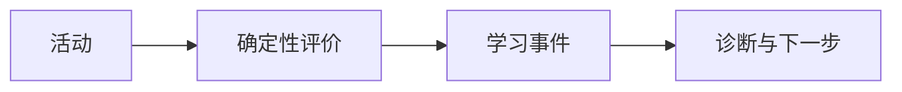

# 确定性学习闭环

> [!important]- 权威边界
> AI 可以解释证据，但掌握度仍由 Java 中的确定性规则计算。
>
> > [!note] 安全执行
> > SQL 必须经过风险分析、确认门、超时和结果上限。

一次学习活动产生证据 $e_i$，策略按固定权重聚合：

$$
M = \frac{\sum_i w_i e_i}{\sum_i w_i}
$$

继续阅读 [[SQL 安全#确认门|SQL 安全边界]]，并查看嵌入示例：![[学习事件模型]]。



不支持的动态查询保持源码降级显示：

```dataview
TABLE status FROM #SQLTeacher
```
